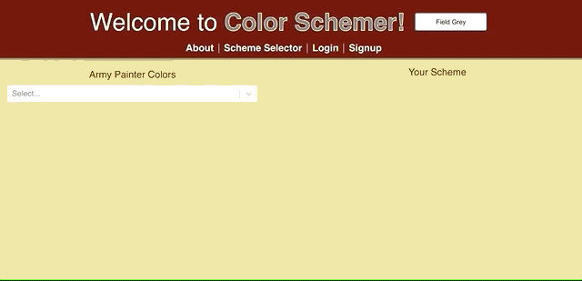
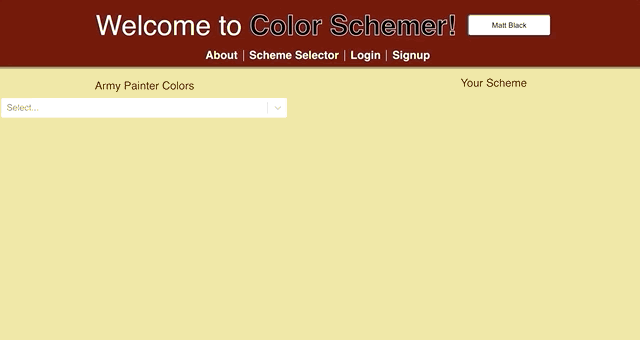

# Color Schemer

### Architecture and Technologies
Color Schemer was built using:
* JavaScript 9
* AWS S3
* React 16.8.6
* Redux 4.0.1
* Ruby on Rails 5.2.3
* PostgreSQL 2.2.2
* webpack 4.32.2
* react-select 3.1.0

### Background and Overview
Color Schemer is a single page app for helping the user determine possible color schemes for a miniature, based on [The Army Painter](https://www.thearmypainter.com/) line of paints

[Live Site](https://color-schemer.herokuapp.com/#/)



### Complementary Color Calculation
The formula for determining the exact complement for an rgb color is fairly straightforward: 255 - each color value.

```JavaScript
function complementCalculator(color){
    let complement = [0, 0, 0]

    for (let i = 0; i < color.length; i++) {
        const element = color[i];
        complement[i] = 255 - element
    }
    return complement
}
```

However, this exact "True Complement" is extremely unlikely to exist in a given paint line. So another algorithm was necessary, to identify the paint closest to the True Complement. The closest complement is determined by iterating over the list of paints and identifying the paint with the least combined difference from the red, green, and blue values of the True Complement.

```JavaScript
function complementLocator(color, colorList){
    const trueComplement = complementCalculator(color.rgba.slice(0, 3))
    let closestComplement
    let leastDelta = 765

    for (let i = 0; i < colorList.length; i++){
        const paint = colorList[i]
        const rgb = paint.rgba.slice(0, 3)
        let delta = 0

        for (let i = 0; i < rgb.length; i++) {
            const element = rgb[i];
            delta += Math.abs(trueComplement[i] - element)
        }
        if (delta < leastDelta){
            leastDelta = delta
            closestComplement = paint
        }
    }
    return closestComplement
}
```


### Color Selection Dropdown
A React-Select dropdown menu was populated with The Army Painter acryllic paints line. The names and rgba values were scraped and converted to JSON using a custom webcrawler. By customizing the React-Select attributes, a sample of each color is displayed alongside each option.



```JavaScript
    const list = sortedPaints.map(
        paint => {
            const name = paint.name
            const rgbaString = `rgba(${paint.rgba.join(",")})`

            const dot = <div style= {{
                background: rgbaString,
                border: "1px solid black",
                height: "15px",
                width: "15px",
                borderRadius: "15px",
                marginLeft: "10px"
                }}
            />
            return({
                "label": 
                    <div className="flex">
                        <span>{name}</span>
                        {dot}
                    </div>,
                "value": {...paint, complement: complementCalculator(paint, paints) },
                "key":{name}
            })
        }
    )
```
